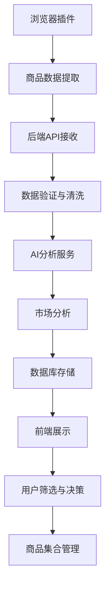
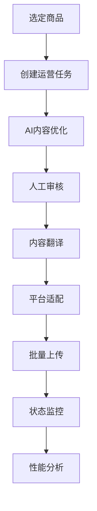

# 电商AI助手系统重新设计文档

## 1. 概述

本文档基于现有需求文档和代码结构，重新设计了电商AI助手系统的前后端数据模型和UI组件架构。新设计遵循模块化、可扩展、数据驱动的原则，支持选品和运营两大核心工作流。

## 2. 数据模型设计

### 2.1 用户相关模型

#### User (用户模型)
```typescript
interface User {
  id: string;
  username: string;
  email: string;
  password_hash: string;
  role: 'admin' | 'operator' | 'viewer';
  preferences: UserPreferences;
  created_at: Date;
  updated_at: Date;
  last_login: Date;
  is_active: boolean;
}

interface UserPreferences {
  language: string;
  timezone: string;
  notification_settings: NotificationSettings;
  dashboard_layout: DashboardLayout;
}
```

#### UserSession (用户会话)
```typescript
interface UserSession {
  id: string;
  user_id: string;
  token: string;
  expires_at: Date;
  created_at: Date;
  ip_address: string;
  user_agent: string;
}
```

### 2.2 选品工作流模型

#### Product (商品模型)
```typescript
interface Product {
  id: string;
  source_url: string;
  source_platform: '1688' | 'taobao' | 'tmall';
  title: string;
  description: string;
  images: ProductImage[];
  price: ProductPrice;
  supplier: SupplierInfo;
  specifications: ProductSpecification[];
  logistics: LogisticsInfo;
  market_analysis: MarketAnalysis;
  ai_analysis: AIAnalysis;
  status: 'pending' | 'analyzing' | 'approved' | 'rejected' | 'published';
  created_at: Date;
  updated_at: Date;
  analyzed_at?: Date;
}

interface ProductImage {
  id: string;
  url: string;
  alt_text: string;
  is_primary: boolean;
  order: number;
}

interface ProductPrice {
  original_price: number;
  wholesale_price: number;
  suggested_retail_price: number;
  currency: string;
  price_tiers: PriceTier[];
}

interface PriceTier {
  min_quantity: number;
  max_quantity?: number;
  unit_price: number;
}

interface SupplierInfo {
  id: string;
  name: string;
  rating: number;
  location: string;
  contact: ContactInfo;
  verification_status: string;
}

interface LogisticsInfo {
  shipping_cost: number;
  shipping_time: string;
  available_methods: ShippingMethod[];
  weight: number;
  dimensions: Dimensions;
}

interface MarketAnalysis {
  competition_level: 'low' | 'medium' | 'high';
  demand_trend: 'rising' | 'stable' | 'declining';
  profit_margin: number;
  market_size: number;
  seasonal_factors: SeasonalFactor[];
}

interface AIAnalysis {
  quality_score: number;
  profit_potential: number;
  risk_assessment: RiskAssessment;
  recommendations: string[];
  confidence_level: number;
}
```

#### ProductCollection (商品集合)
```typescript
interface ProductCollection {
  id: string;
  name: string;
  description: string;
  user_id: string;
  product_ids: string[];
  filters: ProductFilter[];
  created_at: Date;
  updated_at: Date;
}

interface ProductFilter {
  field: string;
  operator: 'eq' | 'gt' | 'lt' | 'in' | 'contains';
  value: any;
}
```

### 2.3 运营工作流模型

#### OperationTask (运营任务)
```typescript
interface OperationTask {
  id: string;
  product_id: string;
  type: 'content_optimization' | 'translation' | 'upload' | 'monitoring';
  status: 'pending' | 'in_progress' | 'completed' | 'failed' | 'cancelled';
  priority: 'low' | 'medium' | 'high' | 'urgent';
  assigned_to?: string;
  content: TaskContent;
  ai_suggestions: AISuggestion[];
  execution_log: ExecutionLog[];
  scheduled_at?: Date;
  started_at?: Date;
  completed_at?: Date;
  created_at: Date;
  updated_at: Date;
}

interface TaskContent {
  original_content: ContentItem[];
  optimized_content: ContentItem[];
  translations: Translation[];
  target_platforms: TargetPlatform[];
}

interface ContentItem {
  type: 'title' | 'description' | 'keywords' | 'images';
  content: string | string[];
  metadata: Record<string, any>;
}

interface Translation {
  language: string;
  content: ContentItem[];
  quality_score: number;
  reviewed: boolean;
}

interface AISuggestion {
  id: string;
  type: 'content_improvement' | 'seo_optimization' | 'translation_fix';
  suggestion: string;
  confidence: number;
  applied: boolean;
  created_at: Date;
}

interface ExecutionLog {
  id: string;
  action: string;
  status: 'success' | 'error' | 'warning';
  message: string;
  timestamp: Date;
  metadata?: Record<string, any>;
}
```

#### Campaign (营销活动)
```typescript
interface Campaign {
  id: string;
  name: string;
  description: string;
  type: 'promotion' | 'seasonal' | 'clearance' | 'new_product';
  product_ids: string[];
  target_platforms: string[];
  content_templates: ContentTemplate[];
  schedule: CampaignSchedule;
  performance_metrics: PerformanceMetrics;
  status: 'draft' | 'scheduled' | 'active' | 'paused' | 'completed';
  created_at: Date;
  updated_at: Date;
}

interface ContentTemplate {
  platform: string;
  template_type: 'title' | 'description' | 'image' | 'video';
  template_content: string;
  variables: TemplateVariable[];
}

interface CampaignSchedule {
  start_date: Date;
  end_date: Date;
  timezone: string;
  recurring: boolean;
  recurrence_pattern?: RecurrencePattern;
}
```

### 2.4 系统模型

#### SystemConfig (系统配置)
```typescript
interface SystemConfig {
  id: string;
  category: 'ai' | 'platform' | 'notification' | 'security';
  key: string;
  value: any;
  description: string;
  is_encrypted: boolean;
  updated_by: string;
  updated_at: Date;
}
```

#### AuditLog (审计日志)
```typescript
interface AuditLog {
  id: string;
  user_id: string;
  action: string;
  resource_type: string;
  resource_id: string;
  old_values?: Record<string, any>;
  new_values?: Record<string, any>;
  ip_address: string;
  user_agent: string;
  timestamp: Date;
}
```

## 3. UI组件架构设计

### 3.1 选品工作流UI组件

#### 商品相关组件
```typescript
// 商品卡片组件
interface ProductCardProps {
  product: Product;
  variant: 'compact' | 'detailed' | 'grid';
  showActions: boolean;
  onSelect?: (product: Product) => void;
  onAnalyze?: (productId: string) => void;
  onAddToCollection?: (productId: string) => void;
}

// 商品列表组件
interface ProductListProps {
  products: Product[];
  loading: boolean;
  filters: ProductFilter[];
  sortBy: SortOption;
  viewMode: 'grid' | 'list' | 'table';
  pagination: PaginationConfig;
  onFilterChange: (filters: ProductFilter[]) => void;
  onSortChange: (sortBy: SortOption) => void;
  onProductSelect: (product: Product) => void;
}

// 商品详情组件
interface ProductDetailProps {
  productId: string;
  showAnalysis: boolean;
  showSupplierInfo: boolean;
  onEdit?: (product: Product) => void;
  onAnalyze?: () => void;
}

// 商品分析面板
interface ProductAnalysisPanelProps {
  analysis: AIAnalysis;
  marketData: MarketAnalysis;
  showRecommendations: boolean;
  onAcceptRecommendation: (recommendation: string) => void;
}
```

#### 筛选和搜索组件
```typescript
// 高级筛选器
interface AdvancedFiltersProps {
  availableFilters: FilterDefinition[];
  activeFilters: ProductFilter[];
  onFiltersChange: (filters: ProductFilter[]) => void;
  onReset: () => void;
}

// 搜索栏组件
interface SearchBarProps {
  placeholder: string;
  suggestions: SearchSuggestion[];
  onSearch: (query: string) => void;
  onSuggestionSelect: (suggestion: SearchSuggestion) => void;
}

// 保存的搜索
interface SavedSearchesProps {
  searches: SavedSearch[];
  onLoad: (search: SavedSearch) => void;
  onSave: (name: string, filters: ProductFilter[]) => void;
  onDelete: (searchId: string) => void;
}
```

### 3.2 运营工作流UI组件

#### 任务管理组件
```typescript
// 任务看板
interface TaskKanbanProps {
  tasks: OperationTask[];
  columns: KanbanColumn[];
  onTaskMove: (taskId: string, newStatus: string) => void;
  onTaskEdit: (task: OperationTask) => void;
  onTaskCreate: () => void;
}

// 任务卡片
interface TaskCardProps {
  task: OperationTask;
  compact: boolean;
  showProgress: boolean;
  onStatusChange: (taskId: string, status: string) => void;
  onAssign: (taskId: string, userId: string) => void;
}

// 任务详情
interface TaskDetailProps {
  taskId: string;
  showExecutionLog: boolean;
  showAISuggestions: boolean;
  onContentEdit: (content: TaskContent) => void;
  onApplySuggestion: (suggestionId: string) => void;
}
```

#### 内容编辑组件
```typescript
// 内容编辑器
interface ContentEditorProps {
  content: ContentItem[];
  aiSuggestions: AISuggestion[];
  onContentChange: (content: ContentItem[]) => void;
  onRequestAISuggestion: (type: string) => void;
  onApplySuggestion: (suggestion: AISuggestion) => void;
}

// 翻译面板
interface TranslationPanelProps {
  originalContent: ContentItem[];
  translations: Translation[];
  targetLanguages: string[];
  onTranslate: (languages: string[]) => void;
  onEditTranslation: (language: string, content: ContentItem[]) => void;
}

// 平台上传组件
interface PlatformUploadProps {
  platforms: TargetPlatform[];
  content: TaskContent;
  uploadStatus: UploadStatus[];
  onUpload: (platforms: string[]) => void;
  onRetry: (platform: string) => void;
}
```

### 3.3 通用UI组件

#### 数据展示组件
```typescript
// 数据表格
interface DataTableProps<T> {
  data: T[];
  columns: TableColumn<T>[];
  loading: boolean;
  pagination: PaginationConfig;
  sorting: SortConfig;
  selection: SelectionConfig<T>;
  onRowClick?: (row: T) => void;
  onSelectionChange?: (selected: T[]) => void;
}

// 统计卡片
interface StatsCardProps {
  title: string;
  value: number | string;
  trend?: TrendData;
  icon?: React.ReactNode;
  color?: 'primary' | 'success' | 'warning' | 'error';
  onClick?: () => void;
}

// 图表组件
interface ChartProps {
  type: 'line' | 'bar' | 'pie' | 'area';
  data: ChartData;
  options: ChartOptions;
  height?: number;
  responsive?: boolean;
}
```

#### 交互组件
```typescript
// 模态框
interface ModalProps {
  isOpen: boolean;
  title: string;
  size: 'sm' | 'md' | 'lg' | 'xl';
  onClose: () => void;
  children: React.ReactNode;
}

// 确认对话框
interface ConfirmDialogProps {
  isOpen: boolean;
  title: string;
  message: string;
  confirmText?: string;
  cancelText?: string;
  onConfirm: () => void;
  onCancel: () => void;
}

// 通知组件
interface NotificationProps {
  type: 'success' | 'error' | 'warning' | 'info';
  title: string;
  message: string;
  duration?: number;
  onClose: () => void;
}
```

### 3.4 页面级组件

#### 仪表板页面
```typescript
interface DashboardPageProps {
  user: User;
  stats: DashboardStats;
  recentTasks: OperationTask[];
  recentProducts: Product[];
  notifications: Notification[];
}

interface DashboardStats {
  totalProducts: number;
  activeTasks: number;
  completedTasksToday: number;
  revenue: number;
  trends: TrendData[];
}
```

#### 商品管理页面
```typescript
interface ProductManagementPageProps {
  initialFilters?: ProductFilter[];
  initialView?: 'grid' | 'list' | 'table';
  showBulkActions?: boolean;
}
```

#### 任务管理页面
```typescript
interface TaskManagementPageProps {
  initialView?: 'kanban' | 'list' | 'calendar';
  showFilters?: boolean;
  allowTaskCreation?: boolean;
}
```

### 3.5 布局组件

#### 主布局
```typescript
interface MainLayoutProps {
  user: User;
  navigation: NavigationItem[];
  notifications: Notification[];
  children: React.ReactNode;
}

interface NavigationItem {
  id: string;
  label: string;
  icon: React.ReactNode;
  path: string;
  children?: NavigationItem[];
  badge?: string | number;
}
```

#### 侧边栏
```typescript
interface SidebarProps {
  items: NavigationItem[];
  collapsed: boolean;
  onToggle: () => void;
  onItemClick: (item: NavigationItem) => void;
}
```

## 4. 数据流设计

### 4.1 选品工作流数据流



### 4.2 运营工作流数据流



## 5. 技术实现要点

### 5.1 前端技术栈
- **框架**: Next.js 14 (React 18)
- **状态管理**: Zustand + React Query
- **UI组件库**: Tailwind CSS + Headless UI
- **表单处理**: React Hook Form + Zod
- **图表**: Recharts
- **国际化**: next-i18next

### 5.2 后端技术栈
- **运行时**: Node.js + TypeScript
- **框架**: Express.js
- **数据库**: MongoDB + Mongoose
- **认证**: JWT + bcrypt
- **文件存储**: AWS S3 / 阿里云OSS
- **队列**: Redis + Bull

### 5.3 数据库设计原则
- **文档型存储**: 利用MongoDB的灵活性存储复杂的商品和任务数据
- **索引优化**: 为常用查询字段建立复合索引
- **数据分片**: 按用户或时间维度进行数据分片
- **缓存策略**: Redis缓存热点数据和查询结果

## 6. 扩展性考虑

### 6.1 模块化设计
- 每个工作流独立模块，可单独部署和扩展
- 组件库统一管理，支持主题定制
- API版本控制，向后兼容

### 6.2 性能优化
- 前端代码分割和懒加载
- 图片CDN和压缩优化
- 数据库查询优化和连接池
- 缓存策略和失效机制

### 6.3 监控和日志
- 用户行为追踪
- 性能监控和告警
- 错误日志收集和分析
- 业务指标统计

## 7. 安全性设计

### 7.1 认证和授权
- JWT token认证
- 基于角色的权限控制(RBAC)
- API访问频率限制
- 敏感操作二次验证

### 7.2 数据安全
- 敏感数据加密存储
- 数据传输HTTPS加密
- 定期数据备份
- 审计日志记录

## 8. 部署和运维

### 8.1 容器化部署
- Docker容器化
- Kubernetes编排
- 自动化CI/CD流水线
- 蓝绿部署策略

### 8.2 监控和维护
- 健康检查和自动重启
- 资源使用监控
- 日志聚合和分析
- 性能指标收集

---

本设计文档提供了电商AI助手系统的完整架构设计，包括数据模型、UI组件、数据流和技术实现等各个方面。设计遵循现代Web应用的最佳实践，具有良好的可扩展性、可维护性和用户体验。